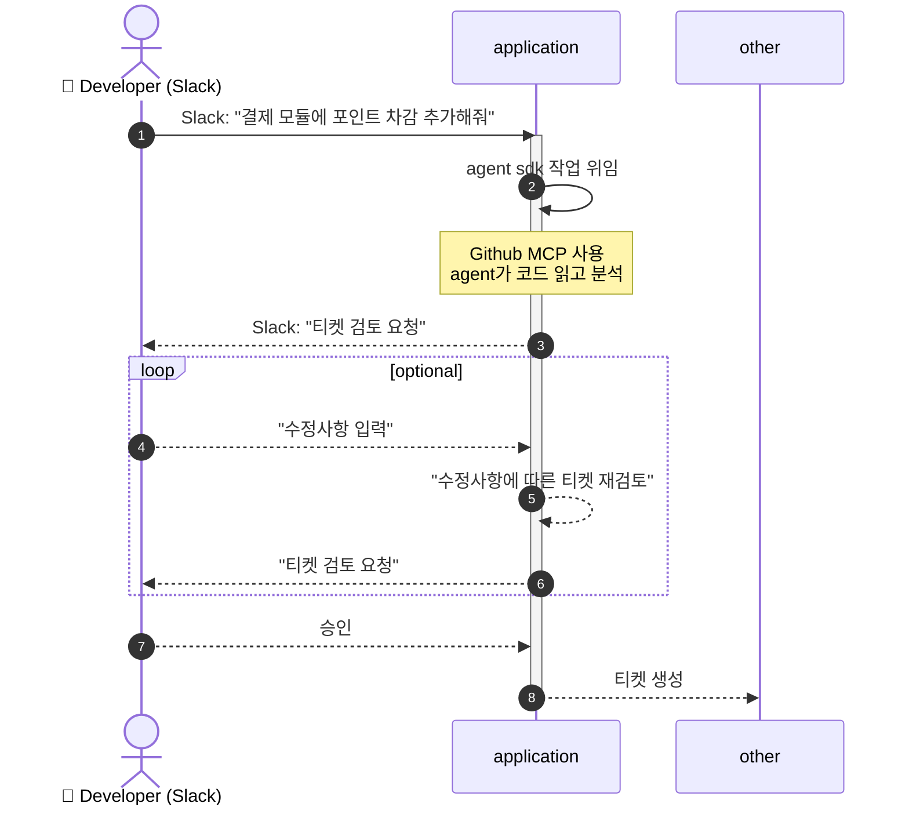

AI 기반 티켓 발급 자동화 시스템

Slack에서 개발 요청을 입력하면 **AI(Claude 등)** 가 현재 코드베이스를 분석하여
개발 티켓과 명세서를 자동으로 생성하는 시스템입니다.

이 시스템은 `barlow-server`와 `barlow-app` 두 개의 저장소를 기반으로 동작하며,
사용자의 요청을 분석하여 기능 추가 / 리팩터링 / 버그 수정에 맞는 티켓을 생성합니다.

## 목적

개발자가 Slack을 통해 자연어로 요청하면 AI가 다음 작업을 자동 수행합니다.

- GitHub 저장소 코드 분석

- 요청 유형 분류

- 작업 티켓 생성

- API Spec 및 수정사항 명세 작성

- 사용자 검토 및 수정 반영

- 최종 티켓 생성

이후 생성된 티켓을 기반으로
로컬 PC에서 Claude Code로 코드 생성
또는 향후 인프라 확장 시 task queue 기반 자동 코드 생성
이 가능하도록 설계합니다.

## 주요 기능
**1️⃣ Slack 기반 요청 인터페이스**

개발자는 Slack에서 다음과 같은 요청을 입력합니다.

기능추가: 결제 모듈에 포인트 차감 기능 추가
버그수정: 로그인 토큰 만료 처리 오류 수정
리팩터링: auth 서비스 구조 정리

**2️⃣ AI 기반 코드 분석**

AI Agent는 GitHub MCP를 통해 다음 작업을 수행합니다.
barlow-server 코드 분석
barlow-app 코드 분석

현재 API 구조 파악
관련 파일 및 의존성 탐색

**3️⃣ 티켓 자동 생성**

요청 유형에 따라 티켓 형식이 달라집니다.

**기능 추가**

생성 항목

- API Spec
- 변경 파일 목록
- 요구사항 정의
- 데이터 모델 변경사항
- 테스트 요구사항

예

Feature: 포인트 차감 기능 추가

```API Spec
POST /payments/use-point

Request
{
  "user_id": string
  "point": number
}

Response
{
  "success": boolean
}
```

**버그 수정**

생성 항목

- 버그 원인 분석

- 수정 위치

- 수정 방법

- 영향 범위

**리팩터링**

생성 항목

- 현재 구조 문제점

- 리팩터링 전략

- 수정 파일 목록

- 코드 변경 방향

## 사용 흐름


Slack Socket Mode를 사용하여 양방향 통신을 구현합니다.

개발 요청 → 티켓 생성 자동화

요구사항 명세 품질 향상

코드 분석 자동화

개발 속도 향상

기술 스택

Python with Slack Bolt

Claude Agent SDK

Open ai Agent SDK

GitHub MCP

---

## 시스템 아키텍쳐

티켓 자동화를 위한 시스템은 다음과 같이 이루어져야 합니다.

0. 공통사항
    - 각 패키지는 독립적이며 결합도를 최소화 합니다.
        - 패키지 간 의존성은 인터페이스를 통해서만 이루어집니다.
        - 하나의 .py 파일의 내부 cohesion은 높아야 하며 파일명에서 내용을 예상 가능해야 합니다.
        - agent 동작 수정 및 출력 형식 변경에 열려있어야 합니다.

    - 코드 스타일
        - 코드 가독성을 중요시 합니다.
        - python에서 자주 사용하는 구조를 따라야 합니다.
        - 객체지향적 설계를 기반으로 구현합니다.
        - 데이터 구조를 명확하게 합니다.
        - 타입을 명확하게 정의합니다.
    
1. Slack 통신 기능
    - slack 과 socket mode를 통해 통신하며 ack 이후 background task를 통해 실행합니다.
    - slack bot에 의한 metion, slash command 등의 이벤트를 기반으로 분기합니다.
    - 각 이벤트에 대한 핸들러가 구현되어 있어야 합니다.
    - Slack 이벤트는 Router를 통해 처리합니다.
        ```
        slack/
        ├ event_router.py
        ├ handlers/
        │   ├ mention_handler.py
        │   ├ slash_handler.py
        │   └ message_handler.py
        ```

2. 세션 관리 기능
    - agent는 세션 기반으로 관리됩니다.
    - 세션은 `<channel_id:user_id>`로 생성되며 각 사용자에 대해 동시에 하나의 agent 작업만 수행할 수 있습니다.
    - 세션 관리 규칙
        - 동일 사용자 요청이 동시에 발생할 경우 기존 작업을 우선시 합니다.
        - 이전 요청이 완료되지 않은 상태에서 새로운 요청이 들어오면 이를 무시하고 즉시 응답을 반환한다.
        - 세션 상태는 lock 기반으로 관리할 수 있다.

3. Agent 관리 기능
    - agent 시스템은 다양한 LLM 제공자를 지원할 수 있도록 설계합니다.
        - 현재 지원: `Claude Agent SDK`, `Open AI Agent SDK`
    - agent의 동작은 추상화되며 역할별로 분리할 수 있어야 합니다.
        ```
        예시
        Planner Agent
        Spec Generator Agent
        Reviewer Agent
        ```
    - ticket 발급 동작 
        - agent의 응답을 사용자가 거절하거나 재고 할 수 있습니다.
        - 사용자가 agent가 설계한 티켓을 accept하기 전까지 이전 버전의 내역을 저장합니다.
        - 저장 내역은 tool로서 구현되며 llm에게 tool 호출 권한을 위임합니다.
        - Github mcp등의 외부 MCP를 tool로서 추가하고 관리합니다.

    - 하나의 작업 완료 후 agent는 현재 사용한 토큰과 비용 추정치 항목을 계산하여 응답합니다.

4. 로그 관련 기능
    - 기본적인 시스템 로그를 출력합니다.
    - agent에 관한 로그는 기록합니다.
        - 로그에는 사용자 입력 내용, agent 출력 내용, input token, output token, estimate cost, agent정보(syspromt 등)이 포함되어야 합니다.
        - agent 정보, 사용자 입력및 출력, 토큰 사용 정보는 각각 다른 파일로 저장하며 id를 통해 trace 가능해야 합니다.
    

5. Agent 동작 및 템플릿 구성
    - 협의 중이며 추후 변경사항이 많아질 예정이기에 이에 확장 가능한 구조로 설계해야 합니다.
```mermaid

```