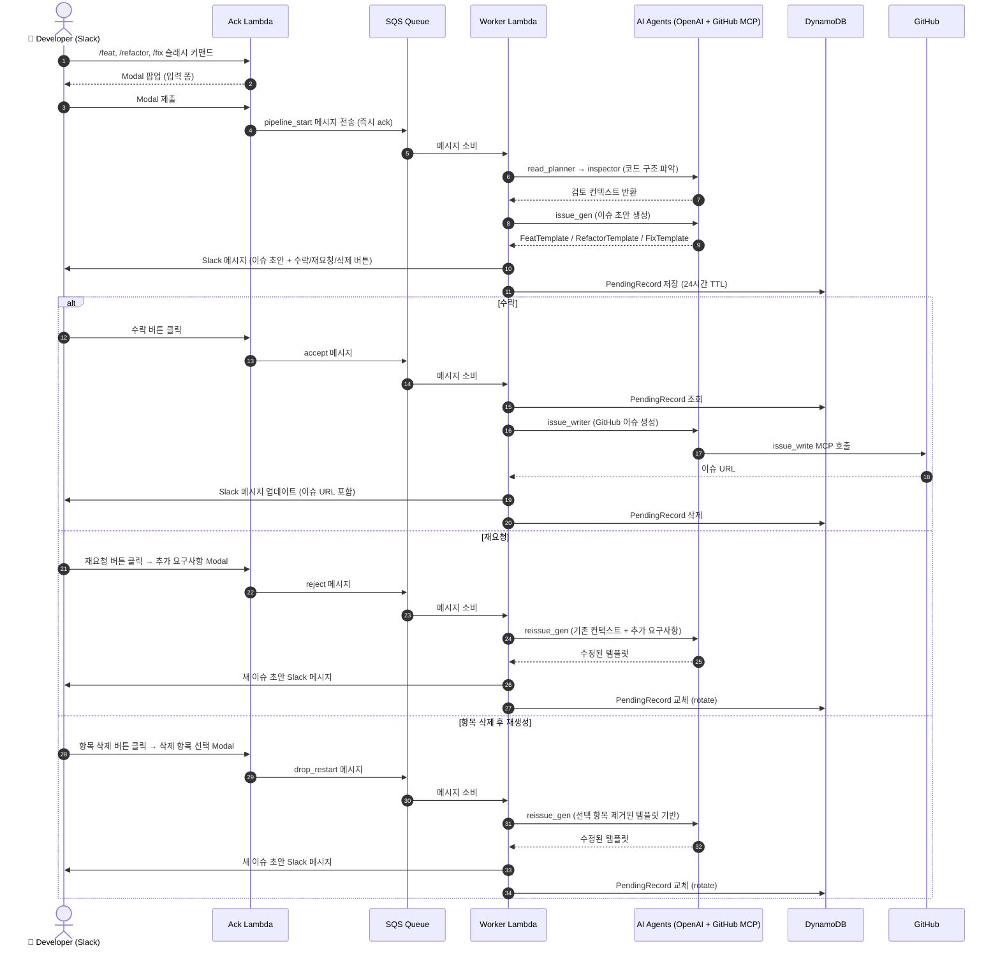

# Barlow Automation

Slack 기반 AI 티켓 자동화 시스템.
개발자가 Slack 슬래시 커맨드로 개발 요청을 입력하면 AI가 GitHub 코드를 분석하여
**feat / refactor / fix** 유형의 GitHub 이슈를 자동 생성합니다.

---

## 목적

- 자연어 요청 → AI 코드 분석 → GitHub 이슈 초안 생성
- 사용자 검토(수락 / 재요청 / 항목 삭제 후 재생성) 후 최종 이슈 등록
- 반복적인 요구사항 정의 작업을 자동화하여 개발 속도 향상

---

## 사용 흐름



---

## 시스템 아키텍처

### Lambda 이중 구조 (Ack + Worker)

Slack은 이벤트 수신 후 **3초 이내 응답**을 요구합니다.
AI 분석은 수십 초 ~ 수 분이 걸리므로 Lambda를 두 개로 분리합니다.

```
Slack ──► Ack Lambda (3초 이내 ack) ──► SQS ──► Worker Lambda (최대 15분)
```

| 항목 | Ack Lambda | Worker Lambda |
|------|-----------|---------------|
| 역할 | Slack 이벤트 수신 → SQS 전송 | SQS 소비 → AI 파이프라인 실행 |
| 진입점 | `src/controller/lambda_ack.py` | `src/lambda_worker.py` |
| 제한 | 3초 이내 응답 필수 | 최대 15분 타임아웃 |

### SQS 메시지 타입

| type | 발생 시점 | Worker 처리 |
|------|----------|------------|
| `pipeline_start` | Modal 제출 | read_planner → issue_gen → Slack 전송 → DB 저장 |
| `accept` | 수락 버튼 클릭 | DB 조회 → issue_writer (GitHub 이슈 생성) → Slack 업데이트 → DB 삭제 |
| `reject` | 재요청 Modal 제출 | reissue_gen → Slack 전송 → DB rotate |
| `drop_restart` | 항목 삭제 Modal 제출 | 항목 제거 → reissue_gen → Slack 전송 → DB rotate |

모든 메시지는 `dedup_id` 필드를 포함하며 DynamoDB 조건부 PutItem으로 중복 처리를 방지합니다.

### 패키지 구조

```
src/
├── controller/               # Slack HTTP 이벤트 처리 (Ack Lambda)
│   ├── lambda_ack.py         # Lambda 진입점
│   ├── app.py                # AsyncApp 팩토리
│   ├── router.py             # 핸들러 등록
│   ├── handler/
│   │   ├── slash.py          # 슬래시 커맨드 + Modal + Block Action 핸들러
│   │   ├── mention.py        # 멘션 핸들러 (슬래시 커맨드 안내)
│   │   └── message.py        # DM 핸들러 (슬래시 커맨드 안내)
│   ├── _reply.py             # Block Kit 빌더 (slack_format, build_issue_blocks 등)
│   ├── issue_drop.py         # 드롭 항목 관리 (droppable_items, drop_items)
│   └── modal_templates/      # Modal 입력 파싱 (FeatModalInput 등)
│
├── services/                 # 비즈니스 로직 오케스트레이션
│   ├── read_planner.py       # read_planner → inspector 체이닝
│   ├── issue_generator.py    # issue_gen 호출
│   ├── re_issue_generator.py # reissue_gen 호출
│   └── issue_creator.py      # issue_writer 호출 → GitHub 이슈 URL 반환
│
├── domain/                   # 순수 도메인 모델 (외부 의존 없음)
│   ├── issue_templates.py    # FeatTemplate, RefactorTemplate, FixTemplate
│   ├── pending.py            # PendingRecord + IPendingRepository
│   └── idempotency.py        # IIdempotencyRepository
│
├── agent/                    # AI 인프라
│   ├── agent_info.py         # AvailableAgents (프롬프트 + 출력 스키마 레지스트리)
│   ├── agent_factory.py      # AgentFactory (read_planner, inspector, issue_gen 등)
│   ├── openai.py             # OpenAIAgent (IAgent 구현체)
│   ├── mcp.py                # GitHubMCPFactory (readProjectTree, readProject, writeIssue)
│   ├── models.py             # 모델 레지스트리 (GPT 가격표)
│   ├── base.py               # IAgent 인터페이스, AgentResult
│   └── usage.py              # AgentUsage (토큰 추적)
│
├── storage/                  # DynamoDB 저장소 구현체
│   ├── request_dynamo_repository.py     # DynamoPendingRepository
│   └── idempotency_dynamo_repository.py # DynamoIdempotencyRepository
│
├── lambda_worker.py          # Worker Lambda 진입점
├── config.py                 # 환경 변수 기반 Config
└── logging_config.py         # 로깅 초기화
```

---

## AI 파이프라인 상세

### pipeline_start

```
user_message (Modal to_prompt() 결과)
    │
    ▼
[read_planner]      ReadPlanOutput 반환
    │               - request_summary, goals, focus_areas
    │               - questions_to_answer, suspected_locations
    │               MCP: get_repository_tree, get_file_contents (읽기 전용)
    ▼
[inspector]         ReadPlanFormat 반환
    │               - searchTarget[]: { id, description, found_dir[] }
    │               MCP: get_repository_tree, get_file_contents (읽기 전용)
    ▼
[issue_gen]         FeatTemplate | RefactorTemplate | FixTemplate 반환
                    MCP: get_file_contents, search_code (읽기 전용)
```

### accept (GitHub 이슈 생성)

```
PendingRecord.typed_output (확정된 템플릿 JSON)
    │
    ▼
[issue_writer]      _IssueCreatedOutput 반환
                    - issue_url, issue_number
                    MCP: issue_write, get_label (쓰기 권한)
```

### reject / drop_restart (재생성)

```
PendingRecord
    ├── inspector_output  (재탐색 없이 재사용)
    └── typed_output      (현재 초안 — drop 시 항목 제거 후 전달)
    │
    ▼
[reissue_gen]       수정된 FeatTemplate | RefactorTemplate | FixTemplate 반환
                    MCP: get_file_contents, search_code (읽기 전용)
```

### 에이전트 목록

| 에이전트 키 | 역할 | MCP 도구셋 |
|------------|------|-----------|
| `READ_PLANNER` | 요청 분석 → 탐색 계획 | `READ_TREE` |
| `READ_TARGET_INSPECTOR` | 계획 기반 코드 탐색 → 관련 디렉토리 확정 | `READ_TREE` |
| `FEAT/REFACTOR/FIX_ISSUE_GEN` | 코드 분석 → 이슈 초안 생성 | `READ_FILES` |
| `FEAT/REFACTOR/FIX_REISSUE_GEN` | 기존 초안 + 추가 요구사항 → 이슈 수정 | `READ_FILES` |
| `FEAT/REFACTOR/FIX_ISSUE_WRITER` | 확정 템플릿 → GitHub 이슈 생성 | `WRITE_ISSUE` |

---

## 슬래시 커맨드 및 Modal

| 커맨드 | callback_id | 생성 템플릿 |
|--------|-------------|------------|
| `/feat` | `feat_submit` | `FeatTemplate` |
| `/refactor` | `refactor_submit` | `RefactorTemplate` |
| `/fix` | `fix_submit` | `FixTemplate` |

### Modal 입력 필드

**`/feat`** — 기능 이름, 배경/목적, 기능 목록, 제약 조건, 디자인 요구사항(선택)

**`/refactor`** — 대상 이름, 배경/목적, 현재 상태(As-Is), 목표 상태(To-Be), 제약 조건(선택)

**`/fix`** — 버그 제목, 증상, 재현 방법, 기대 동작, 관련 영역(선택)

### Block Action 버튼

| action_id | 동작 |
|-----------|------|
| `issue_accept` | SQS `accept` 메시지 전송 |
| `issue_reject` | 재요청 Modal 오픈 (추가 요구사항 입력) |
| `issue_drop` | 항목 삭제 Modal 오픈 (드롭 항목 다중 선택) |

---

## 데이터 모델

### PendingRecord (`barlow-pending`, TTL 24시간)

```python
@dataclass
class PendingRecord:
    pk: str                      # Slack message_ts (이슈 초안 메시지 타임스탬프)
    subcommand: str              # "feat" | "refactor" | "fix"
    user_id: str
    channel_id: str
    user_message: str            # Modal to_prompt() 결과
    inspector_output: str        # Inspector 출력 JSON (재요청 시 재사용)
    typed_output: BaseIssueTemplate
    ttl: int                     # Unix timestamp (24시간 후 자동 삭제)
```

### 이슈 템플릿

```python
class FeatTemplate(BaseIssueTemplate):
    issue_title: str
    about: str
    new_features: list[str]
    domain_rules: list[str]
    domain_constraints: list[str]

class RefactorTemplate(BaseIssueTemplate):
    issue_title: str
    about: str
    goals: list[_Goal]           # as_is: list[str], to_be: list[str]
    domain_rules: list[str]
    domain_constraints: list[str]

class FixTemplate(BaseIssueTemplate):
    issue_title: str
    about: str
    problems: list[_Problem]             # issue, suggestion
    implementation: list[_ImplementationStep]  # step, todo
    domain_rules: list[str]
    domain_constraints: list[str]
```

---

## 멱등성

SQS 메시지의 `dedup_id`(view_id 또는 action_ts)를 사용합니다.

```
Worker Lambda 처리 시작
    │
    ▼
DynamoDB barlow-idempotency 조건부 PutItem (attribute_not_exists(pk))
    ├── 성공 → PROCESSING 상태로 저장 → 파이프라인 실행 → DONE 업데이트
    └── 실패 (ConditionalCheckFailedException) → 중복 이벤트 → 즉시 종료
```

TTL: 1시간 (동일 이벤트 재시도 허용 윈도우)

---

## 에러 핸들링

Worker Lambda 파이프라인 실행 중 예외 발생 시:

1. `logger.error`로 스택 트레이스 기록
2. `channel_id`가 있으면 Slack에 오류 메시지 전송
3. Lambda 정상 종료 (SQS Dead Letter Queue로 이동하지 않음)

---

## 기술 스택

| 분류 | 기술 |
|------|------|
| 언어 | Python 3.12+ |
| Slack | Slack Bolt (HTTP Mode, Async) |
| AI | OpenAI Agents SDK |
| GitHub | GitHub MCP (Streamable HTTP via `api.githubcopilot.com/mcp/`) |
| AWS | Lambda (Ack + Worker), SQS, DynamoDB |

---

## 환경 변수

| 변수명 | 설명 |
|--------|------|
| `SLACK_BOT_TOKEN` | Slack Bot OAuth 토큰 (`xoxb-...`) |
| `SLACK_SIGNING_SECRET` | Slack 앱 서명 시크릿 |
| `OPENAI_API_KEY` | OpenAI API 키 |
| `ANTHROPIC_API_KEY` | Anthropic API 키 |
| `GITHUB_TOKEN` | GitHub Personal Access Token |
| `SQS_QUEUE_URL` | SQS 큐 URL |
| `TARGET_REPO` | 분석 대상 저장소 (`owner/repo`) |
