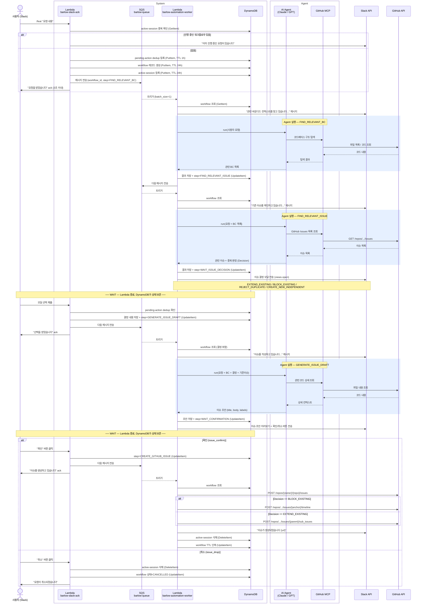
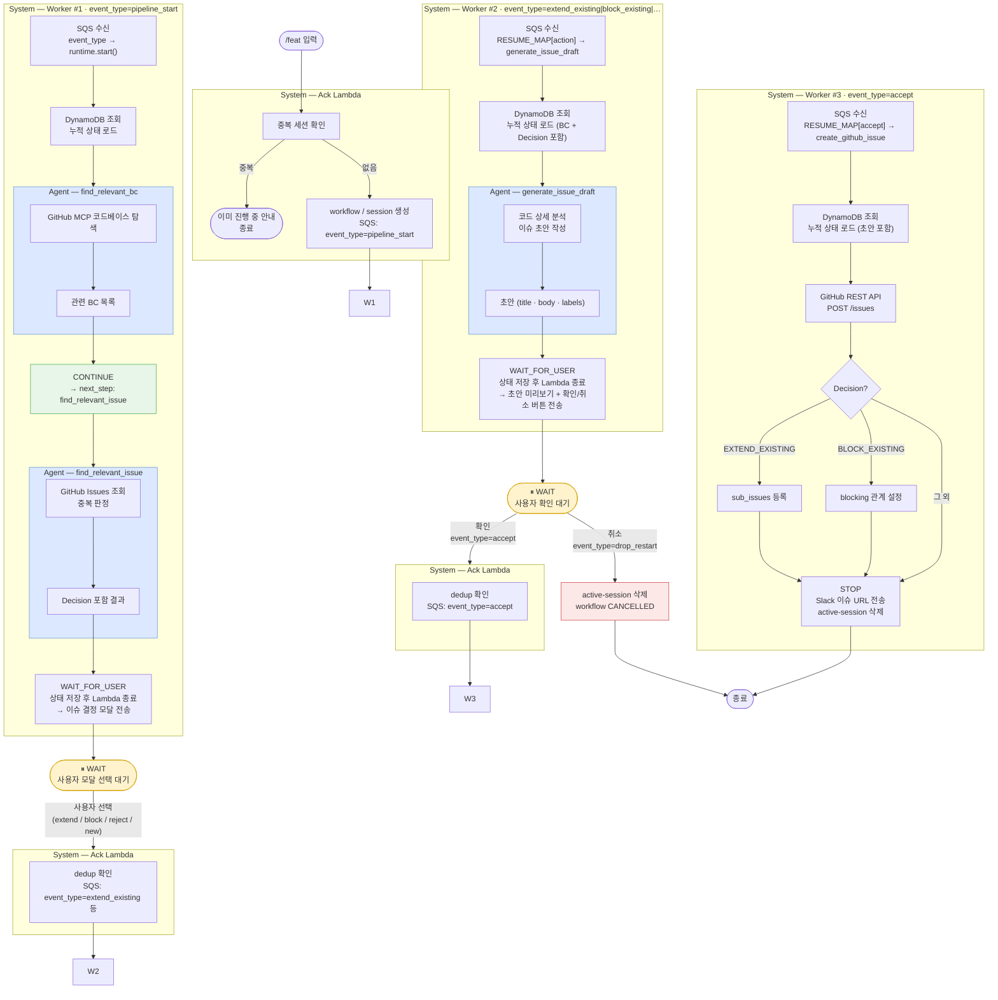
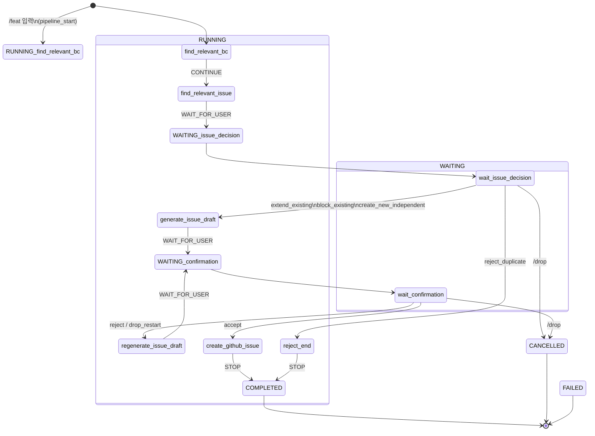

# Feat Request Workflow

슬래시 커맨드 `/feat` 입력부터 GitHub 이슈 생성까지의 전체 흐름.

---



---

## Lambda 실행 경계

| 실행 회차 | Step | 트리거 | Agent 호출 |
|-----------|------|--------|-----------|
| #1 | FIND_RELEVANT_BC | `/feat` 슬래시 커맨드 | O — 코드베이스 BC 탐색 |
| #2 | FIND_RELEVANT_ISSUE | SQS | O — 기존 이슈 분석 + Decision |
| WAIT | WAIT_ISSUE_DECISION | 사용자 모달 응답 대기 | — |
| #3 | GENERATE_ISSUE_DRAFT | 모달 제출 | O — 이슈 초안 생성 |
| WAIT | WAIT_CONFIRMATION | 사용자 확인 버튼 대기 | — |
| #4 | CREATE_GITHUB_ISSUE | 확인 버튼 클릭 | — (REST API 직접 호출) |

각 WAIT 구간에서 Lambda는 종료된다. DynamoDB가 상태를 보존하여 다음 실행에서 이어받는다.

## 역할 분리

| 구분 | 담당 |
|------|------|
| **System** | 이벤트 라우팅, dedup, 상태 저장/조회, Slack ack |
| **Agent** | 코드 분석, 이슈 탐색 및 판정, 이슈 초안 작성 |

Agent는 Worker Lambda 내부에서 호출되며, MCP를 통해서만 GitHub에 접근한다.
Agent 실행 결과는 Worker가 DynamoDB에 저장하여 다음 실행으로 전달한다.

## 멱등성 보장

- **pending-action**: Slack action_ts 기반 dedup (TTL 1h). 동일 버튼을 두 번 눌러도 한 번만 처리.
- **active-session**: channel+user 키로 동시 워크플로우 중복 차단 (TTL 24h).
- **SQS batch_size=1**: 동일 메시지가 두 Worker에게 동시 전달되지 않음.

---

## Step별 흐름 요약

> **Worker가 "무엇을 할지" 결정하는 방법**
> - **SQS 메시지의 `event_type`(action)** → `RESUME_MAP[action]`으로 다음 step 결정
> - **DynamoDB** → step 라우팅이 아닌 누적 상태(BC 목록·이슈 목록·초안 등) 컨텍스트 제공
> - Worker 한 실행 안에서 `WAIT` / `STOP` 신호가 나올 때까지 step을 연속 실행



### step 연속 실행 구조 (Worker #1 예시)

Worker 한 번의 Lambda 실행 안에서 `_execute_until_wait()` 루프가 돌며 여러 step을 처리한다.

```
SQS: pipeline_start
  └─ runtime.start()
       └─ _execute_until_wait()
            ├─ find_relevant_bc  → CONTINUE → next_step 설정 후 계속
            ├─ find_relevant_issue → WAIT_FOR_USER → 저장 후 break
            └─ (Lambda 종료)
```

```
SQS: accept
  └─ runtime.resume(action="accept")
       └─ RESUME_MAP["accept"] = "create_github_issue"
       └─ _execute_until_wait()
            ├─ create_github_issue → STOP → 저장 후 break
            └─ (Lambda 종료)
```

---

## 상태 다이어그램

`WorkflowStatus` × `current_step` 기준. RUNNING 상태는 Lambda 실행 중, WAITING은 Lambda 종료 후 사용자 응답 대기.



### 전이 요약

| 현재 상태 | 트리거 | 다음 상태 |
|---|---|---|
| `[시작]` | `/feat` | RUNNING · find_relevant_bc |
| find_relevant_bc | CONTINUE | find_relevant_issue |
| find_relevant_issue | CONTINUE → WAIT | WAITING · wait_issue_decision |
| wait_issue_decision | extend / block / create_new | RUNNING · generate_issue_draft |
| wait_issue_decision | reject_duplicate | RUNNING · reject_end → COMPLETED |
| wait_issue_decision | /drop | CANCELLED |
| generate_issue_draft | CONTINUE → WAIT | WAITING · wait_confirmation |
| wait_confirmation | accept | RUNNING · create_github_issue → COMPLETED |
| wait_confirmation | reject / drop_restart | RUNNING · regenerate_issue_draft → WAITING |
| wait_confirmation | /drop | CANCELLED |
